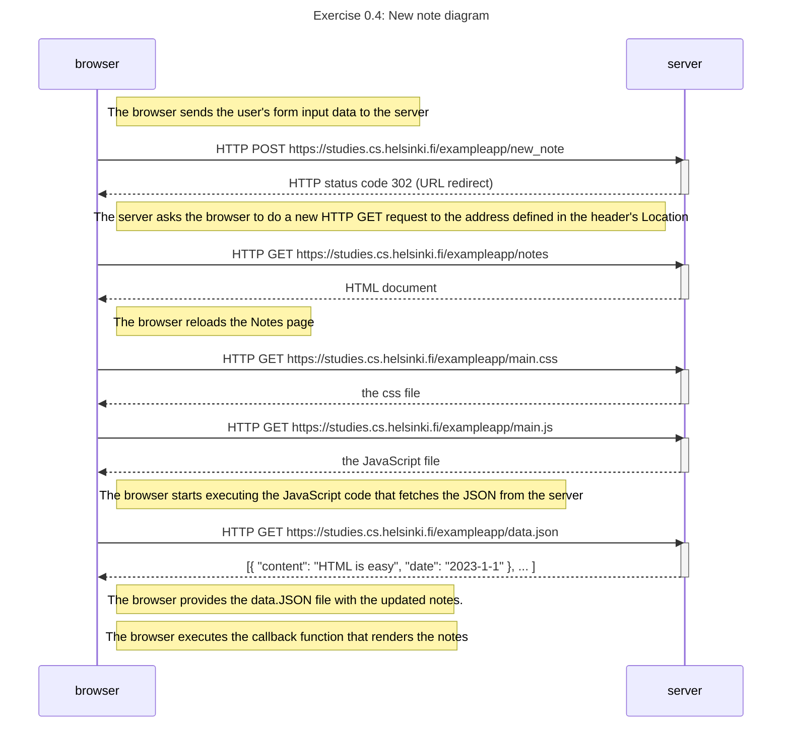

```mermaid
sequenceDiagram
    title Exercise 0.4: New note diagram
    participant browser
    participant server

    Note right of browser: The browser sends the user's form input data to the server
    browser->>server: HTTP POST https://studies.cs.helsinki.fi/exampleapp/new_note
    activate server
    server-->>browser: HTTP status code 302 (URL redirect)
    deactivate server
    Note left of server: The server asks the browser to do a new HTTP GET request to the address defined in the header's Location

    browser->>server: HTTP GET https://studies.cs.helsinki.fi/exampleapp/notes
    activate server
    server-->>browser: HTML document
    deactivate server
    Note right of browser: The browser reloads the Notes page


    browser->>server: HTTP GET https://studies.cs.helsinki.fi/exampleapp/main.css
    activate server
    server-->>browser: the css file
    deactivate server

    browser->>server: HTTP GET https://studies.cs.helsinki.fi/exampleapp/main.js
    activate server
    server-->>browser: the JavaScript file
    deactivate server
    Note right of browser: The browser starts executing the JavaScript code that fetches the JSON from the server

    browser->>server: HTTP GET https://studies.cs.helsinki.fi/exampleapp/data.json
    activate server
    server-->>browser: [{ "content": "HTML is easy", "date": "2023-1-1" }, ... ]
    deactivate server
    Note right of browser: The browser provides the data.JSON file with the updated notes.
    Note right of browser: The browser executes the callback function that renders the notes
```