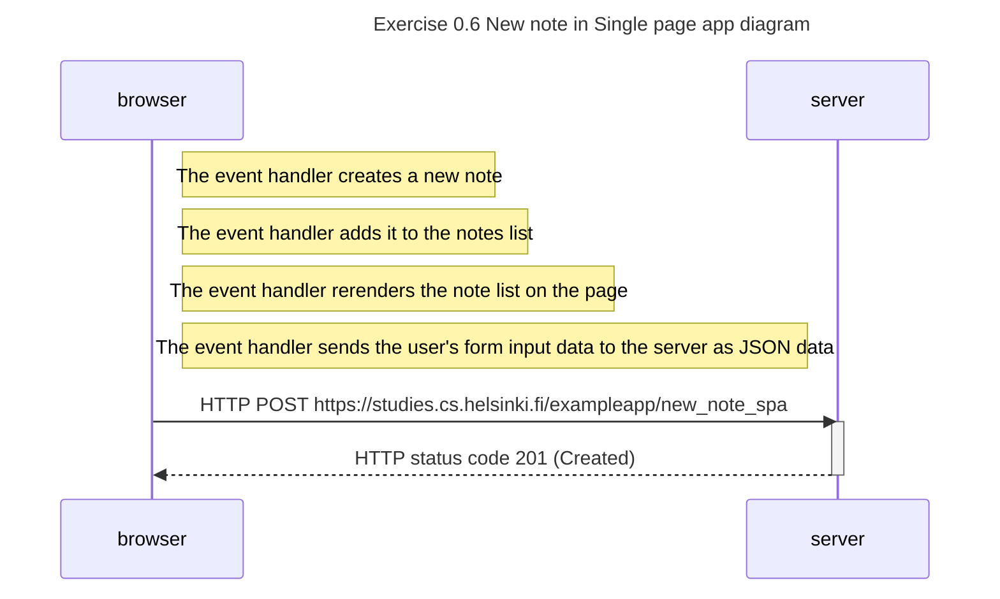

```mermaid
sequenceDiagram
    title Exercise 0.6 New note in Single page app diagram
    participant browser
    participant server

    Note right of browser: The event handler creates a new note
    Note right of browser: The event handler adds it to the notes list
    Note right of browser: The event handler rerenders the note list on the page 
    Note right of browser: The event handler sends the user's form input data to the server as JSON data
    browser->>server: HTTP POST https://studies.cs.helsinki.fi/exampleapp/new_note_spa
    activate server
    server-->>browser: HTTP status code 201 (Created)
    deactivate server
```